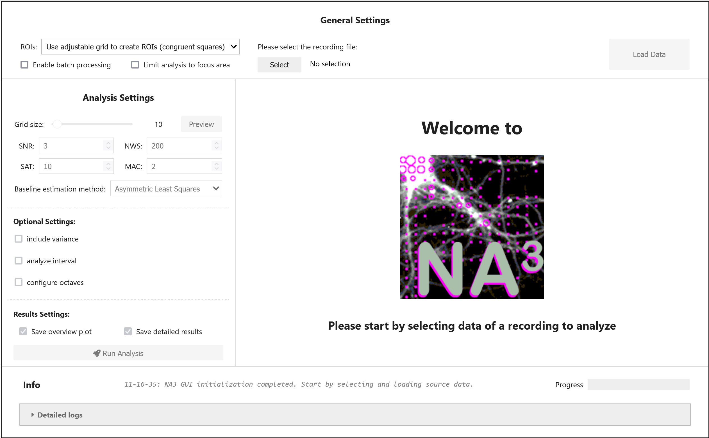

# Getting started


<!-- WARNING: THIS FILE WAS AUTOGENERATED! DO NOT EDIT! -->

After you successfully completed the installation of neuralactivitycubic
(NA³), open JupyterLab in your browser run the following commands in a
Jupyter Notebook to open the graphical user interface (GUI) of NA³:

``` python
import neuralactivitycubic as na3

na3.open_gui()
```

    VBox(children=(HBox(children=(VBox(children=(HTML(value="<p style='font-size:16px; font-weight:bold; text-alig…



## General Settings

lorem ipsum lorem ipsum lorem ipsum

### ROI modes:

lorem ipsum lorem ipsum lorem ipsum

#### Grid (congruent squares):

lorem ipsum lorem ipsum lorem ipsum

#### Predefined ROIs:

lorem ipsum lorem ipsum lorem ipsum

### Batch mode:

lorem ipsum lorem ipsum lorem ipsum

### Focus areas:

lorem ipsum lorem ipsum lorem ipsum

### Source data:

lorem ipsum lorem ipsum lorem ipsum

## Analysis Settings:

lorem ipsum lorem ipsum lorem ipsum

### Optional settings:

lorem ipsum lorem ipsum lorem ipsum

### Result settings:

lorem ipsum lorem ipsum lorem ipsum

## Generated Results:

lorem ipsum lorem ipsum lorem ipsum
