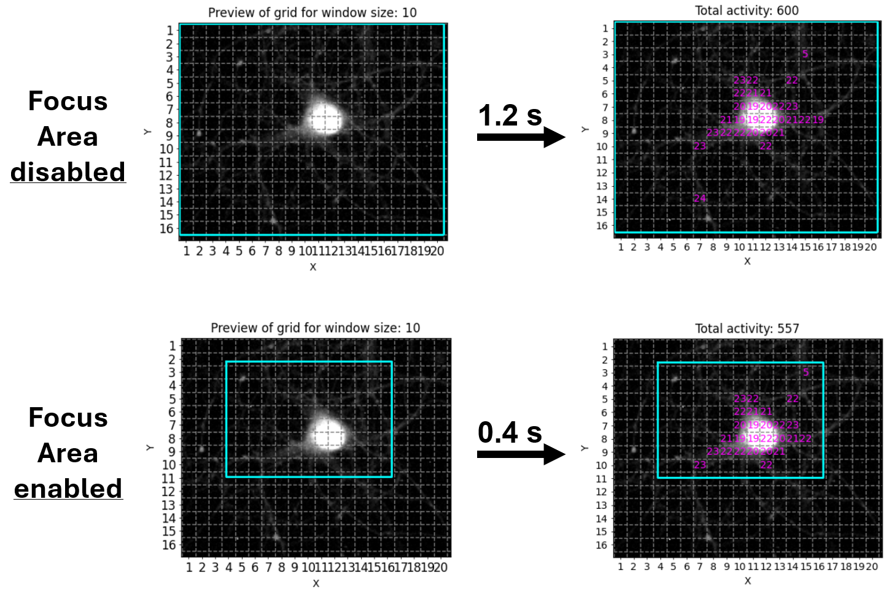

# Using NA³ via the GUI


<!-- WARNING: THIS FILE WAS AUTOGENERATED! DO NOT EDIT! -->

<div>

> **Note**
>
> We´re still putting a few finishing touches onto the new
> implementation of NA³, so please be aware that this version remains
> under active development and should not yet be considered as a stable
> release.

</div>

<div>

> **Tip**
>
> We´re currently working on a paper describing our work in more
> details - make sure you stay tuned and regularly check these docs for
> updates!

</div>

## Launching the GUI

After you successfully completed the installation of NA³ (e.g. by
following our [Installation
Guide](https://indoc-research.github.io/NeuralActivityCubic/installation.html)),
please open a JupyterNotebook to launch the GUI of NA³.

To do this, open the Anaconda Prompt terminal (or the terminal of your
choice) and make sure the virtual environment in which you installed NA³
is active. If you followed our installation guide, you should see that
the input line starts with `(na3)`. If this is not the case, you can
always activate it by running the following command:

``` python
conda activate na3
```

With the virtual environment in which you installed NA³ activated,
please execute the following command in the terminal:

``` python
jupyter-lab
```

Next, open a new JupyterNotebook by clicking on the “Python 3
(ipykernel)” button in the *Notebook* section. In this JupyterNotebook,
paste the following code in a cell:

``` python
import neuralactivitycubic as na3

na3.open_gui()
```

Then, as a final step, execute the cell, for instance by clicking on the
little play icon on top while the cell is selected and the GUI of NA³
will open in the Notebook:

[./media/launch_na3_gui.mp4](./media/launch_na3_gui.mp4)

<div>

> **Tip**
>
> If you´re working on a smaller screen, e.g. if you´re using a
> notebook, you can use the keyboard shortcut `Ctrl + b` to collapse the
> file explorer panel of JupyterLab to the left of the JupyterNotebook
> to give you some extra horizontal space. You can always use the same
> keyboard shortcut again to bring it back again if needed.

</div>

## Quick Walkthrough

We´re all busy people and documentation can be quite exhaustive to read.
Thus, here´s a quick walkthrough of NA³´s core functionalities that
should allow you to get going with your own first tests:

[./media/GUI_walkthrough.mp4](./media/GUI_walkthrough.mp4)

For more detailed descriptions of the individual features and settings,
please see the sections below.

## General Settings

The first section of NA³’s GUI prompts you to specify the general
settings of your analysis before being able to continue. Most
importantly, the selections will have an impact on the structure and
organization of your source data that NA³ expects. Thus, please make
sure you consult the Source Data Structure section below to check what
structure is requested for your specific combination of settings.

### ROI modes:

NA³´s core functionality is to compute the signal intensity over time
for defined regions of interest (ROIs) within the whole image. You
either have the chance to provide source data that defines these ROIs
(“Predefined ROIs”), or you can use NA³´s “Grid” mode to automatically
create congruent square ROIs over your recording with adjustable sizes
(`Grid size` - see Analysis Settings) that will be analyzed.

#### Grid (congruent squares):

The main advantage of NA³´s Grid mode is that it does not require any
additional input other than your recording file to start the analysis
with NA³. This can be especially useful in high-throughput settings, as
it eliminates additional (potentially manual) preprocessing steps to
generate ROIs.

#### Predefined ROIs:

Sometimes you want to investigate specific features instead of the whole
field of view, though. For this, NA³ provides the option for you to
provide predefined ROIs along with your source data. Currently, only
ROIs created with the [ImageJ tools](https://imagej.net/) are supported.

<div>

> **Tip**
>
> The predefined ROI filetype that your are using is currently not
> supported? That needs to be changed! Please drop us your feature
> request via
> [GitHub](https://github.com/Indoc-Research/NeuralActivityCubic/issues/new)
> and we´ll implement it for you asap.

</div>

### Batch mode:

The period of trouble shooting and of adjusting individual experimental
parameters is finally over and you are ready to process all your data at
once? That´s awesome, congrats! As an additional reward, NA³ offers you
a batch mode feature: You select your entire dataset as source data and
then only have to specify the settings once, hit “Run Analysis” and then
leave for a well deserved end-of-day, while NA³ and your computer do the
heavy lifting for you and process your entire dataset, recording after
recording. Batch mode is compatible with all ROI-modes (Grid &
predefined ROIs), and can even be combined with Focus Areas.

### Focus areas:

This feature is for those of you who want - or may need - to squeeze out
every single percent of processing speed. It allows you to provide
another ROI (or even set of ROIs), to which NA³ will restrict it´s
analysis, while ignoring any ROIs that reside outside of these Focus
Areas. Since processing of each ROI takes ~ the same amount of time (it
can be considered a linear operation), not processing 50 % of the ROIs
will cut your processing time almost in half! We tried to illustrate
this with the following example, in which we used NA³´s Grid mode with
the Focus Area being disabled or enabled, saving ~2/3´s of processing
time:

<figure>

<figcaption aria-hidden="true">Focus Area mode to max out
performance.</figcaption>
</figure>

### Source data structure

lorem ipsum lorem ipsum lorem ipsum

## Analysis Settings:

lorem ipsum lorem ipsum lorem ipsum

### Optional settings:

lorem ipsum lorem ipsum lorem ipsum

### Result settings:

lorem ipsum lorem ipsum lorem ipsum

## Generated Results:

lorem ipsum lorem ipsum lorem ipsum
