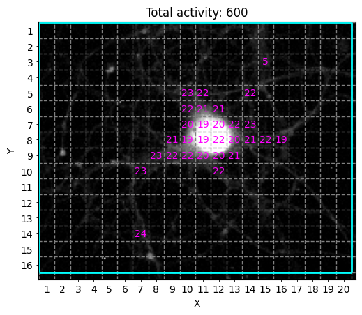

# model


<!-- WARNING: THIS FILE WAS AUTOGENERATED! DO NOT EDIT! -->

------------------------------------------------------------------------

<a
href="https://github.com/ddoll/NeuralActivityCubic/blob/main/neuralactivitycubic/model.py#L26"
target="_blank" style="float:right; font-size:smaller">source</a>

### Logger

>  Logger ()

*Initialize self. See help(type(self)) for accurate signature.*

------------------------------------------------------------------------

<a
href="https://github.com/ddoll/NeuralActivityCubic/blob/main/neuralactivitycubic/model.py#L50"
target="_blank" style="float:right; font-size:smaller">source</a>

### Model

>  Model (config:neuralactivitycubic.datamodels.Config|str)

*Initialize self. See help(type(self)) for accurate signature.*

Setup for testing:

``` python
from shutil import rmtree
import pandas as pd
from pandas.testing import assert_frame_equal

from neuralactivitycubic.view import WidgetsInterface

test_filepath = Path('../test_data/00')
example_results_dir = Path('../test_data/00/example_test_results_for_spiking_neuron')
results_filepath = Path('../test_data/00/results_directory')


def test_correct_model_run():
    correct_config = WidgetsInterface().export_user_settings()
    correct_config.data_source_path = test_filepath / 'spiking_neuron.avi'
    correct_config.save_single_trace_results = True
    model = Model(correct_config)
    model.create_analysis_jobs()
    model.run_analysis()
    # evil hacks
    return model.analysis_job_queue[0].results_dir_path

def test_correct_model_run_with_custom_results_dir():
    correct_config = WidgetsInterface().export_user_settings()
    correct_config.data_source_path = test_filepath / 'spiking_neuron.avi'
    correct_config.results_filepath = results_filepath
    model = Model(correct_config)
    model.create_analysis_jobs()
    model.run_analysis()
    return correct_config.results_filepath
```

``` python
def _test_csv_files(relative_filepath_to_csv: str, results_dir: Path) -> bool:
    filepath = results_dir / relative_filepath_to_csv
    # confirm results have been created:
    if not filepath.is_file():
        return False
    # confirm computational consistency of results, while allowing minor numerical tolerance
    df_test = pd.read_csv(filepath)
    df_validation = pd.read_csv(example_results_dir / relative_filepath_to_csv)
    if assert_frame_equal(df_test, df_validation) is not None:
        return False
    else:
        return True

def test_all_peak_results(results_dir):
    return _test_csv_files('all_peak_results.csv', results_dir)

def test_amplitude_and_df_over_f_results(results_dir):
    return _test_csv_files('Amplitude_and_dF_over_F_results.csv', results_dir)

def test_auc_results(results_dir):
    return _test_csv_files('AUC_results.csv', results_dir)

def test_variance_area_results(results_dir):
    return _test_csv_files('Variance_area_results.csv', results_dir)

def test_representative_single_trace_results(results_dir):
    return _test_csv_files('single_traces/data_of_ROI_7-10.csv', results_dir)
```

``` python
def test_activity_overview_png(results_dir):
    filepath = results_dir / 'activity_overview.png'
    return filepath.is_file()

def test_roi_label_ids_overview_png(results_dir):
    filepath = results_dir / 'ROI_label_IDs_overview.png'
    return filepath.is_file()

def test_individual_traces_with_identified_events_pdf(results_dir):
    filepath = results_dir / 'Individual_traces_with_identified_events.pdf'
    return filepath.is_file()

def test_logs_txt(results_dir):
    filepath = results_dir / 'logs.txt'
    return filepath.is_file()

def test_user_settings_json(results_dir):
    filepath = results_dir / 'user_settings.json'
    return filepath.is_file()

def test_nwb_export(results_dir):
    filepath = results_dir / 'autogenerated_nwb_file.nwb'
```

Run tests:

``` python
# confirm that model can be executed:
results_directory = test_correct_model_run()

assert results_directory.exists()

# confirm all csv files have been created and are correct:
assert test_all_peak_results(results_directory), 'There is an issue with the "all_peak_results.csv" file!'
assert test_amplitude_and_df_over_f_results(results_directory)
assert test_auc_results(results_directory)
assert test_variance_area_results(results_directory)
assert test_representative_single_trace_results(results_directory)

# confirm all other result files have been created:
assert test_activity_overview_png(results_directory)
assert test_roi_label_ids_overview_png(results_directory)
assert test_individual_traces_with_identified_events_pdf(results_directory)
assert test_logs_txt(results_directory)
assert test_user_settings_json(results_directory)

# cleanup
rmtree(results_directory)
```

    02-07-25 12:00:54.655666 (UTC): Basic configurations for data import validated. Starting creation of analysis job(s)...
    02-07-25 12:00:54.655714 (UTC): Starting with Job creation(s) for ../test_data/00/spiking_neuron.avi
    02-07-25 12:00:54.655767 (UTC): Found recording file of supported type at: ../test_data/00/spiking_neuron.avi.
    02-07-25 12:00:54.655823 (UTC): Successfully created a single job for ../test_data/00/spiking_neuron.avi at queue position: #1.
    02-07-25 12:00:54.655838 (UTC): Finished Job creation(s) for ../test_data/00/spiking_neuron.avi!
    02-07-25 12:00:54.655845 (UTC): All job creation(s) completed.
    02-07-25 12:00:54.655853 (UTC): Configurations for Analysis Settings and Result Creation validated successfully.
    02-07-25 12:00:54.655861 (UTC): Analysis Settings are:
    02-07-25 12:00:54.655918 (UTC): batch_mode: False
    02-07-25 12:00:54.655927 (UTC): baseline_estimation_method: asls
    02-07-25 12:00:54.655933 (UTC): customize_octave_filtering: False
    02-07-25 12:00:54.655940 (UTC): data_source_path: ../test_data/00/spiking_neuron.avi
    02-07-25 12:00:54.655946 (UTC): end_frame_idx: 500
    02-07-25 12:00:54.655953 (UTC): focus_area_enabled: False
    02-07-25 12:00:54.655959 (UTC): focus_area_filepath: None
    02-07-25 12:00:54.655966 (UTC): grid_size: 10
    02-07-25 12:00:54.655972 (UTC): include_variance: False
    02-07-25 12:00:54.655979 (UTC): mean_signal_threshold: 10.0
    02-07-25 12:00:54.655985 (UTC): min_octave_span: 1.0
    02-07-25 12:00:54.655991 (UTC): min_peak_count: 2
    02-07-25 12:00:54.655998 (UTC): noise_window_size: 200
    02-07-25 12:00:54.656004 (UTC): recording_filepath: None
    02-07-25 12:00:54.656011 (UTC): results_filepath: None
    02-07-25 12:00:54.656017 (UTC): roi_filepath: None
    02-07-25 12:00:54.656023 (UTC): roi_mode: grid
    02-07-25 12:00:54.656029 (UTC): save_overview_png: True
    02-07-25 12:00:54.656035 (UTC): save_single_trace_results: True
    02-07-25 12:00:54.656044 (UTC): save_summary_results: True
    02-07-25 12:00:54.656050 (UTC): signal_to_noise_ratio: 3.0
    02-07-25 12:00:54.656056 (UTC): start_frame_idx: 0
    02-07-25 12:00:54.656062 (UTC): use_frame_range: False
    02-07-25 12:00:54.656068 (UTC): variance_window_size: 15
    02-07-25 12:00:54.656075 (UTC): Starting analysis...
    02-07-25 12:00:54.656083 (UTC): Starting to process analysis job with index #0.
    02-07-25 12:00:55.381320 (UTC): Analysis successfully completed. Continue with creation of results.. 
    02-07-25 12:00:58.072123 (UTC): Results successfully created at: ../test_data/00/2025_07_02_14-00-54_results_for_spiking_neuron
    Logs saved to ../test_data/00/2025_07_02_14-00-54_results_for_spiking_neuron/logs.txt
    02-07-25 12:00:58.072675 (UTC): Updating all log files to contain all logs as final step. All valid logs files will end with this message.
    Logs saved to ../test_data/00/2025_07_02_14-00-54_results_for_spiking_neuron/logs.txt



``` python
# confirm that model can be executed with custom results directory:
results_directory = test_correct_model_run_with_custom_results_dir()

assert results_directory.exists()

# confirm all csv files have been created and are correct:
assert test_all_peak_results(results_directory), 'There is an issue with the "all_peak_results.csv" file!'
assert test_amplitude_and_df_over_f_results(results_directory)
assert test_auc_results(results_directory)
assert test_variance_area_results(results_directory)

# confirm all other result files have been created:
assert test_activity_overview_png(results_directory)
assert test_roi_label_ids_overview_png(results_directory)
assert test_logs_txt(results_directory)
assert test_user_settings_json(results_directory)

# cleanup
rmtree(results_directory)
```

    02-07-25 12:00:58.375384 (UTC): Basic configurations for data import validated. Starting creation of analysis job(s)...
    02-07-25 12:00:58.375449 (UTC): Starting with Job creation(s) for ../test_data/00/spiking_neuron.avi
    02-07-25 12:00:58.375495 (UTC): Found recording file of supported type at: ../test_data/00/spiking_neuron.avi.
    02-07-25 12:00:58.375540 (UTC): Successfully created a single job for ../test_data/00/spiking_neuron.avi at queue position: #1.
    02-07-25 12:00:58.375549 (UTC): Finished Job creation(s) for ../test_data/00/spiking_neuron.avi!
    02-07-25 12:00:58.375556 (UTC): All job creation(s) completed.
    02-07-25 12:00:58.375563 (UTC): Configurations for Analysis Settings and Result Creation validated successfully.
    02-07-25 12:00:58.375571 (UTC): Analysis Settings are:
    02-07-25 12:00:58.375635 (UTC): batch_mode: False
    02-07-25 12:00:58.375645 (UTC): baseline_estimation_method: asls
    02-07-25 12:00:58.375652 (UTC): customize_octave_filtering: False
    02-07-25 12:00:58.375659 (UTC): data_source_path: ../test_data/00/spiking_neuron.avi
    02-07-25 12:00:58.375666 (UTC): end_frame_idx: 500
    02-07-25 12:00:58.375673 (UTC): focus_area_enabled: False
    02-07-25 12:00:58.375680 (UTC): focus_area_filepath: None
    02-07-25 12:00:58.375686 (UTC): grid_size: 10
    02-07-25 12:00:58.375693 (UTC): include_variance: False
    02-07-25 12:00:58.375699 (UTC): mean_signal_threshold: 10.0
    02-07-25 12:00:58.375706 (UTC): min_octave_span: 1.0
    02-07-25 12:00:58.375712 (UTC): min_peak_count: 2
    02-07-25 12:00:58.375718 (UTC): noise_window_size: 200
    02-07-25 12:00:58.375725 (UTC): recording_filepath: None
    02-07-25 12:00:58.375731 (UTC): results_filepath: ../test_data/00/results_directory
    02-07-25 12:00:58.375738 (UTC): roi_filepath: None
    02-07-25 12:00:58.375744 (UTC): roi_mode: grid
    02-07-25 12:00:58.375751 (UTC): save_overview_png: True
    02-07-25 12:00:58.375758 (UTC): save_single_trace_results: False
    02-07-25 12:00:58.375765 (UTC): save_summary_results: True
    02-07-25 12:00:58.375772 (UTC): signal_to_noise_ratio: 3.0
    02-07-25 12:00:58.375778 (UTC): start_frame_idx: 0
    02-07-25 12:00:58.375784 (UTC): use_frame_range: False
    02-07-25 12:00:58.375791 (UTC): variance_window_size: 15
    02-07-25 12:00:58.375798 (UTC): Starting analysis...
    02-07-25 12:00:58.375806 (UTC): Starting to process analysis job with index #0.
    02-07-25 12:00:59.002000 (UTC): Analysis successfully completed. Continue with creation of results.. 
    02-07-25 12:01:01.558814 (UTC): Results successfully created at: ../test_data/00/results_directory
    Logs saved to ../test_data/00/results_directory/logs.txt
    02-07-25 12:01:01.559384 (UTC): Updating all log files to contain all logs as final step. All valid logs files will end with this message.
    Logs saved to ../test_data/00/results_directory/logs.txt


