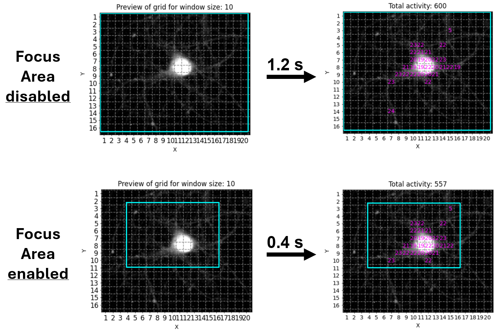
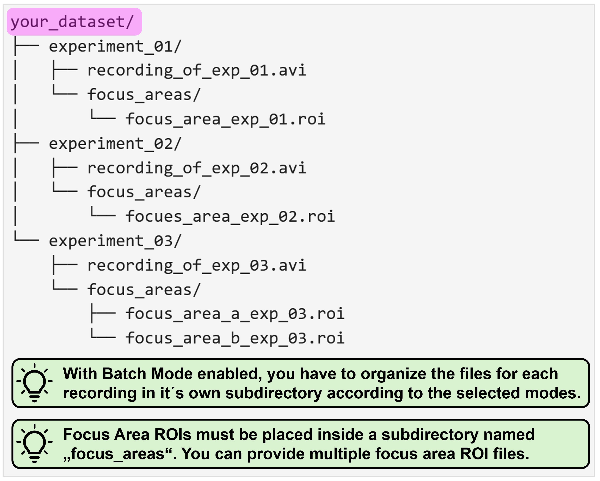
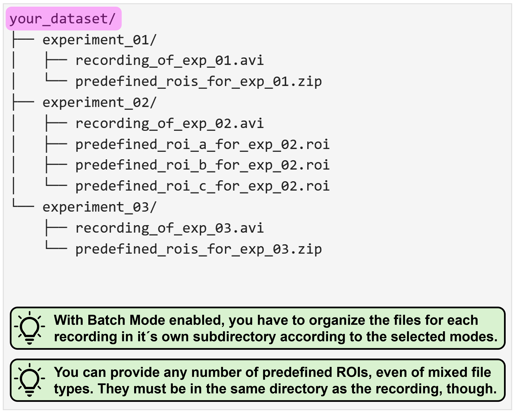
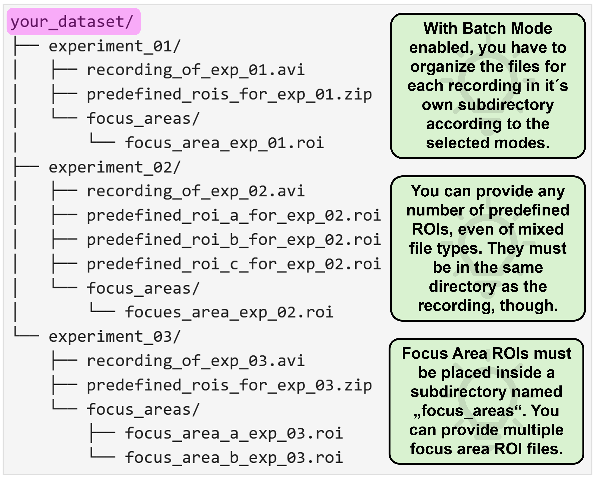
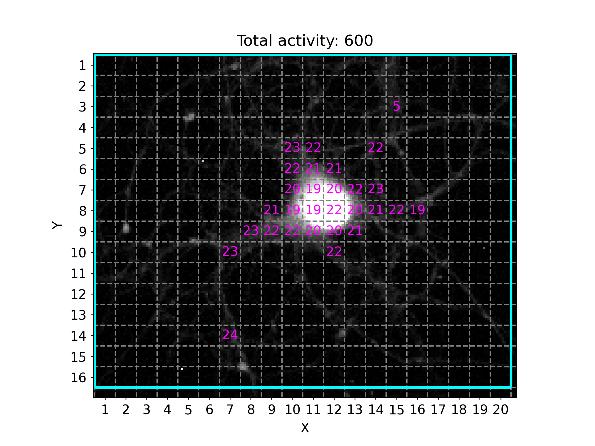
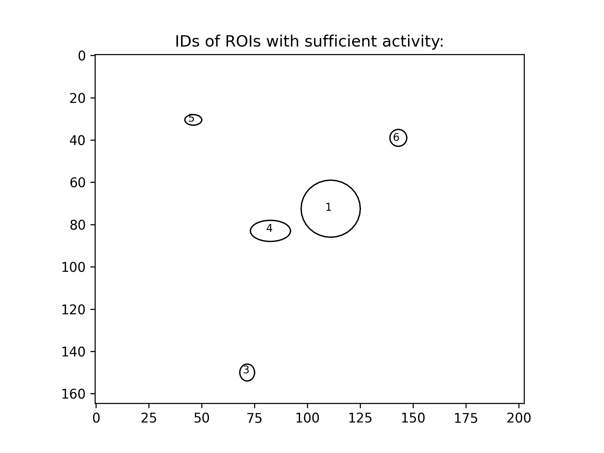
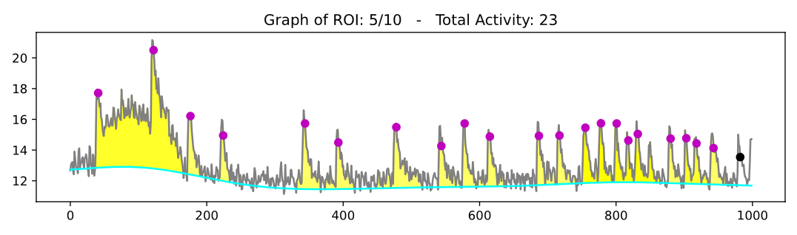

# Using NA³ via the GUI


<!-- WARNING: THIS FILE WAS AUTOGENERATED! DO NOT EDIT! -->

<div>

> **Note**
>
> We´re still putting a few finishing touches onto the new
> implementation of NA³, so please be aware that this version remains
> under active development and should not yet be considered as a stable
> release.

</div>

<div>

> **Tip**
>
> We´re currently working on a paper describing our work in more
> details - make sure you stay tuned and regularly check these docs for
> updates!

</div>

## Launching the GUI

After you successfully completed the installation of NA³ (e.g. by
following our [Installation
Guide](https://indoc-research.github.io/NeuralActivityCubic/installation.html)),
please open a JupyterNotebook to launch the GUI of NA³.

To do this, open the Anaconda Prompt terminal (or the terminal of your
choice) and make sure the virtual environment in which you installed NA³
is active. If you followed our installation guide, you should see that
the input line starts with `(na3)`. If this is not the case, you can
always activate it by running the following command:

``` python
conda activate na3
```

With the virtual environment in which you installed NA³ activated,
please execute the following command in the terminal:

``` python
jupyter-lab
```

Next, open a new JupyterNotebook by clicking on the “Python 3
(ipykernel)” button in the *Notebook* section. In this JupyterNotebook,
paste the following code in a cell:

``` python
import neuralactivitycubic as na3

na3.open_gui()
```

Then, as a final step, execute the cell, for instance by clicking on the
little play icon on top while the cell is selected and the GUI of NA³
will open in the Notebook:


<div>

> **Tip**
>
> If you´re working on a smaller screen, e.g. if you´re using a
> notebook, you can use the keyboard shortcut `Ctrl + b` to collapse the
> file explorer panel of JupyterLab to the left of the JupyterNotebook
> to give you some extra horizontal space. You can always use the same
> keyboard shortcut again to bring it back again if needed.

</div>

## Quick Walkthrough

We´re all busy people and documentation can be quite exhaustive to read.
Thus, here´s a quick walkthrough of NA³´s core functionalities that
should allow you to get going with your own first tests:


For more detailed descriptions of the individual features and settings,
please see the sections below.

## General Settings

The first section of NA³’s GUI prompts you to specify the general
settings of your analysis before being able to continue. Most
importantly, the selections will have an impact on the structure and
organization of your source data that NA³ expects. Thus, please make
sure you consult the Source Data Structure section below to check what
structure is requested for your specific combination of settings.

### ROI modes

NA³´s core functionality is to compute the signal intensity over time
for defined regions of interest (ROIs) within the whole image. You
either have the chance to provide source data that defines these ROIs
(“Predefined ROIs”), or you can use NA³´s “Grid” mode to automatically
create congruent square ROIs over your recording with adjustable sizes
(`Grid size` - see Analysis Settings) that will be analyzed.

#### Grid (congruent squares)

The main advantage of NA³´s Grid mode is that it does not require any
additional input other than your recording file to start the analysis
with NA³. This can be especially useful in high-throughput settings, as
it eliminates additional (potentially manual) preprocessing steps to
generate ROIs.

#### Predefined ROIs

Sometimes you want to investigate specific features instead of the whole
field of view, though. For this, NA³ provides the option for you to
provide predefined ROIs along with your source data. Currently, only
ROIs created with the [ImageJ tools](https://imagej.net/) are supported.

<div>

> **Tip**
>
> The predefined ROI filetype that your are using is currently not
> supported? That needs to be changed! Please drop us your feature
> request via
> [GitHub](https://github.com/Indoc-Research/NeuralActivityCubic/issues/new)
> and we´ll implement it for you asap.

</div>

### Batch mode

The period of trouble shooting and of adjusting individual experimental
parameters is finally over and you are ready to process all your data at
once? That´s awesome, congrats! As an additional reward, NA³ offers you
a batch mode feature: You select your entire dataset as source data and
then only have to specify the settings once, hit “Run Analysis” and then
leave for a well deserved end-of-day, while NA³ and your computer do the
heavy lifting for you and process your entire dataset, recording after
recording. Batch mode is compatible with all ROI-modes (Grid &
predefined ROIs), and can even be combined with Focus Areas.

### Focus areas

This feature is for those of you who want - or may need - to squeeze out
every single percent of processing speed. It allows you to provide
another ROI (or even set of ROIs), to which NA³ will restrict it´s
analysis, while ignoring any ROIs that reside outside of these Focus
Areas. Since processing of each ROI takes ~ the same amount of time (it
can be considered a linear operation), not processing 50 % of the ROIs
will cut your processing time almost in half! We tried to illustrate
this with the following example, in which we used NA³´s Grid mode with
the Focus Area being disabled or enabled, saving ~2/3´s of processing
time:

<figure>

<figcaption aria-hidden="true">Focus Area mode to max out
performance.</figcaption>
</figure>

### Source data structure

NA³ expects your source data to be organized in a very specific manner
for it to function correctly, and this structure looks slightly
different, depending on which processing modes you want to use. We
actually spent quite some time thinking about it, with the intention of
creating a structure that does not result in conflicts when you start
switching between modes when exploring what method fits your data best
and requires you to constantly re-adjust your source data. But this will
only become evident over time when people like you test and use NA³ - so
we´d highly appreciate your feedback, especially if you should run into
some issues with the required source data structures! Please open an
issue on GitHub and we´re eager to fix it.

To understand what source data structure is expected for your specific
combination of processing modes, we provide you with representative
examples for each. Please expand the following sections to browse
through them. In all cases, the “Source Data Path” that you have to
select when using NA³ is always the file/folder that is shown at the
very top and is highlighted in magenta (e.g. the parent directory
`your_dataset/` or `single_recording/`, or the recording file itself
`your_recording_file.avi`):

<div>

> **ROI-mode: Grid**
>
> <div>
>
> > **Focus Area: OFF**
> >
> > This is as straightforward as it gets! All you need to do is select
> > the recording file you´d like to analyze:
> >
> > <figure>
> >  > src="./media/Source_Data_Structure_Grid-ON_Focus-OFF_Batch-OFF_cropped.png"
> > width="600"
> > alt="Batch-mode: OFF | ROI-mode: Grid (congruent squares) | Focus Area: OFF" />
> > <figcaption aria-hidden="true">Batch-mode: OFF | ROI-mode: Grid
> > (congruent squares) | Focus Area: OFF</figcaption>
> > </figure>
>
> </div>
>
> <div>
>
> > **Focus Area: ON**
> >
> > This requires you to organize your data within a directory (called
> > `single_recording` in this example) which contains your recording
> > file and another subdirectory in which the Focus Area ROI(s) are
> > located. This subdirectory must be called `focus_areas` for NA³ to
> > be able to recognize it:
> >
> > <figure>
> >  > src="./media/Source_Data_Structure_Grid-ON_Focus-ON_Batch-OFF_cropped.png"
> > width="600"
> > alt="Batch-mode: OFF | ROI-mode: Grid (congruent squares) | Focus Area: ON" />
> > <figcaption aria-hidden="true">Batch-mode: OFF | ROI-mode: Grid
> > (congruent squares) | Focus Area: ON</figcaption>
> > </figure>
>
> </div>

</div>

<div>

> **ROI-mode: predefined ROIs**
>
> <div>
>
> > **Focus Area: OFF**
> >
> > Using predefined ROIs for analysis rather than the automatically
> > generated Grid requires you to organize your source data within a
> > directory (called `single_recording` in this example), which
> > contains a single recording file (e.g. `your_recording.avi` in this
> > example) and as many ROI files as you need. In this example, there
> > is only a single `predefined_ROIs.zip` file, which was generated
> > with ImageJ2 and which contains multiple ROIs. You could, however,
> > also provide each ROI individually, e.g. as `ROI_a.roi`,
> > `ROI_b.roi`, and so on.
> >
> > <figure>
> >  > src="./media/Source_Data_Structure_Grid-OFF_Focus-OFF_Batch-OFF_cropped.png"
> > width="600"
> > alt="Batch-mode: OFF | ROI-mode: predefined ROIs | Focus Area: OFF" />
> > <figcaption aria-hidden="true">Batch-mode: OFF | ROI-mode: predefined
> > ROIs | Focus Area: OFF</figcaption>
> > </figure>
>
> </div>
>
> <div>
>
> > **Focus Area: ON**
> >
> > Using predefined ROIs for analysis rather than the automatically
> > generated Grid requires you to organize your source data within a
> > directory (called `single_recording` in this example), which
> > contains a single recording file (e.g. `your_recording.avi` in this
> > example) and as many ROI files as you need. In this example, there
> > is only a single `predefined_ROIs.zip` file, which was generated
> > with ImageJ2 and which contains multiple ROIs. You could, however,
> > also provide each ROI individually, e.g. as `ROI_a.roi`,
> > `ROI_b.roi`, and so on.
> >
> > For NA³ to differentiate between predefined ROIs you´d like to
> > analyze, and ROIs that are intended as Focus Areas, you have to
> > provide the Focus Area ROIs within a subdirectory that must be named
> > `focus_areas`. In this directory, you can provide as many ROI files
> > as needed, just like for the predefined ROIs.
> >
> > <figure>
> >  > src="./media/Source_Data_Structure_Grid-OFF_Focus-ON_Batch-OFF_cropped.png"
> > width="600"
> > alt="Batch-mode: OFF | ROI-mode: predefined ROIs | Focus Area: ON" />
> > <figcaption aria-hidden="true">Batch-mode: OFF | ROI-mode: predefined
> > ROIs | Focus Area: ON</figcaption>
> > </figure>
>
> </div>

</div>

<div>

> **Batch mode: ON**
>
> With activate batch mode, you essentially have to provide the same
> data structure as described above for each individual recording, and
> then organize all recordings as nested directory. You can find some
> representative examples again for all possible mode combinations with
> enabled batch mode below:
>
> <div>
>
> > **ROI-mode: Grid**
> >
> > <div>
> >
> > > **Focus Area: OFF**
> > >
> > > In this case, you only need to separate the respective recording
> > > files in individual subdirectories:
> > >
> > > <figure>
> > >  > > src="./media/Source_Data_Structure_Grid-ON_Focus-OFF_Batch-ON_cropped.png"
> > > width="600"
> > > alt="Batch-mode: ON | ROI-mode: Grid (congruent squares) | Focus Area: OFF" />
> > > <figcaption aria-hidden="true">Batch-mode: ON | ROI-mode: Grid
> > > (congruent squares) | Focus Area: OFF</figcaption>
> > > </figure>
> >
> > </div>
> >
> > <div>
> >
> > > **Focus Area: ON**
> > >
> > > With enabled Focus Area, you can specify focus area ROIs for each
> > > recording individually. For this, you have to add a subdirectory
> > > called `focus_areas` within the respective recording subdirectory.
> > > Please note, that you can add different focus area ROIs for each
> > > recording, and you can also opt to not provide any focus area ROIs
> > > for individual recordings - here, the entire field of view will
> > > then be analyzed.
> > >
> > > <figure>
> > >  > > width="600"
> > > alt="Batch-mode: ON | ROI-mode: Grid (congruent squares) | Focus Area: ON" />
> > > <figcaption aria-hidden="true">Batch-mode: ON | ROI-mode: Grid
> > > (congruent squares) | Focus Area: ON</figcaption>
> > > </figure>
> >
> > </div>
>
> </div>
>
> <div>
>
> > **ROI-mode: predefined ROIs**
> >
> > <div>
> >
> > > **Focus Area: OFF**
> > >
> > > If you´d like to use batch mode processing in combination of using
> > > predefined ROIs for analyses, please organize your individual
> > > recordings together with the corresponding ROI files into separate
> > > subdirectories. Please note, that you can (obviously) provide
> > > different ROI files for each recording, and that they also don´t
> > > have to be of the same filetype (e.g. `.zip` and `.roi` files in
> > > this example):
> > >
> > > <figure>
> > >  > > width="600"
> > > alt="Batch-mode: ON | ROI-mode: predefined ROIs | Focus Area: OFF" />
> > > <figcaption aria-hidden="true">Batch-mode: ON | ROI-mode: predefined
> > > ROIs | Focus Area: OFF</figcaption>
> > > </figure>
> >
> > </div>
> >
> > <div>
> >
> > > **Focus Area: ON**
> > >
> > > To use predefined ROIs with enabled Focus Area and batch mode,
> > > please provide your data organized as depicted below. Again,
> > > please note that any combination of ROI files - for both
> > > predefined ROIs and Focus Areas - is possible. For the Focus
> > > Areas, it´s also supported to not provide ROIs for individual
> > > recordings. You always have to provide some predefined ROIs,
> > > though, if you select this mode.
> > >
> > > <figure>
> > >  > > width="600"
> > > alt="Batch-mode: ON | ROI-mode: predefined ROIs | Focus Area: ON" />
> > > <figcaption aria-hidden="true">Batch-mode: ON | ROI-mode: predefined
> > > ROIs | Focus Area: ON</figcaption>
> > > </figure>
> >
> > </div>
>
> </div>

</div>

## Analysis Settings

NA³ provides you with several option to configure the analysis exactly
as you need it for your specific dataset. There are a few settings,
however, that are strictly required (grouped here in the “Analysis
Settings”) and some that are optional (correpsondingly in the “Optional
Settings”). For all required settings, there are default values
specified that NA³ will use if you don´t change them. They certainly
provide a generic good-fit, but you might want to tweak some of them as
needed to accomodate for some special characteristics of your individual
dataset!

### Grid Size

Allows you to specify the size in pixel of the congruent squares that
will be generated and used as ROIs for analysis. For instance, selecting
“10” means that NA³ will create 10 x 10 pixel squares as ROIs for
analysis. You can use the *Preview* button next to the slider widget to
create a preview of how the grid would look like on your specific data.
Moreover, NA³ will highlight the area within the field of view within
which the indicated squares will be analyzed by a cyan box. This can be
of interest, as NA³ might crop your image - depending on the dimensions
of your field of view and the selected grid size - to ensure equal sizes
of the square ROIs across the entire field of view. Again, as an
example, if your field of view is 432 x 567 px, and you specify a grid
size of 10 x 10 px, NA³ will crop your field of view by 2 and 7 pixels,
respectively - i.e. to 430 x 560 px - to be able to fill the entire
(remaining) field of view with congruent squares.

<div>

> **Note**
>
> Please note that this setting is only available in the ROI mode “Grid
> (congruent squares)” is selected.

</div>

### Signal-to-Noise Ratio (SNR)

To identify peaks within the signal intensity trace (i.e. a timeseries
of bit-values) for each analysis ROI, NA³ leverages the
[find_peaks_cwt](https://docs.scipy.org/doc/scipy/reference/generated/scipy.signal.find_peaks_cwt.html)
function implemented by SciPy. The SNR value you specify in NA³ will be
used as `min_snr` in when calling the
[find_peaks_cwt](https://docs.scipy.org/doc/scipy/reference/generated/scipy.signal.find_peaks_cwt.html)
function.

### Noise Window Size (NWS)

The SNR value you specify in NA³ will be used as `window_size` in when
calling the
[find_peaks_cwt](https://docs.scipy.org/doc/scipy/reference/generated/scipy.signal.find_peaks_cwt.html)
function.

### Signal Average Threshold (SAT)

This value allows you to correct for global background noise. For each
analysis ROI, NA³ computes the mean intensity value over the entire
timeseries for the specified analysis interval. Only if this “average
signal” matches or exceeds the defined SAT value, peak detection
computations will be performed for this analysis ROI.

### Minimal Activity Counts (MAC)

Allows to filter out analysis ROIs with too few peaks. If there were
less peaks detected for a given analysis ROI than defined as MAC, this
ROI will be excluded from the final results.

### Baseline Estimation Method

NA³ computes area-under-curve for the identified peaks. In order to do
so, a baseline for the signal is required. For this, NA³ leverages a
selection of the baseline estimation methods offered by
[pybaselines](https://pybaselines.readthedocs.io/en/latest/):

- Asymmetric Least Squares: Uses the
  [asls](https://pybaselines.readthedocs.io/en/latest/api/pybaselines/api/index.html#pybaselines.api.Baseline.asls)
  method with it´s default values. See
  [here](https://pybaselines.readthedocs.io/en/latest/algorithms/whittaker.html#asls-asymmetric-least-squares)
  for additional information and representative baseline computations
  using this method.

- Fully Automatic Baseline Correction: Uses the
  [fabc](https://pybaselines.readthedocs.io/en/latest/api/pybaselines/api/index.html#pybaselines.api.Baseline.fabc)
  method with it´s default values. See
  [here](https://pybaselines.readthedocs.io/en/latest/algorithms/classification.html#fabc-fully-automatic-baseline-correction)
  for additional information and representative baseline computations
  using this method.

- Peaked Signal’s Asymmetric Least Squares Algorithm: Uses the
  [asls](https://pybaselines.readthedocs.io/en/latest/api/pybaselines/api/index.html#pybaselines.api.Baseline.psalsa)
  method with it´s default values. See
  [here](https://pybaselines.readthedocs.io/en/latest/algorithms/whittaker.html#psalsa-peaked-signal-s-asymmetric-least-squares-algorithm)
  for additional information and representative baseline computations
  using this method.

- Standard Deviation Distribution: Uses the
  [asls](https://pybaselines.readthedocs.io/en/latest/api/pybaselines/api/index.html#pybaselines.api.Baseline.std_distribution)
  method with it´s default values. See
  [here](https://pybaselines.readthedocs.io/en/latest/algorithms/classification.html#std-distribution-standard-deviation-distribution)
  for additional information and representative baseline computations
  using this method.

<div>

> **Not the Baseline Estimation method you´re looking for?!**
>
> With the highly modular design of NA³, it is very straightforward for
> us to implement any of the baseline estimation methods provided by the
> [pybaselines](https://pybaselines.readthedocs.io/en/latest/) Python
> package. So if there is another one that sparks your interest or is
> absolutely crucial for your specific analysis - don´t hesitate for
> even a second! Please drop us your request directly via
> [GitHub](https://github.com/Indoc-Research/NeuralActivityCubic/issues/new)
> and we´ll be happy to implement it for you.

</div>

## Optional settings

NA³ also provides you with some optional settings. These are - as their
category indicates - not required for processing of your Calcium Imaging
data, but enable you to make some very specifc adjustments. To enable
them, click the check box and the corresponding settings widget will
appear - uncheck the checkbox again, and the settings widgets dissapear
(and the settings you made will be ignored).

### Include Variance

As described in the original paper by Prada et al. (2018), the signal´s
variance can be used as a proxy for neuronal excitability[1]. To enable
variance computation of the signal for your analysis, click the checkbox
next to “include variance”. A new widget will appear and allow you to
specify the `Variance` value (default: 15). This is the window size that
will be used to compute the variance of the signal intensity for each
analysis ROI with a sliding window approach.

### Analyze Interval

If you are interested in analyzing only a specific interval of your
recording, this feature is for you. Simply enable it by clicking the
checkbox and another widget will appear, allowing you to use two sliders
that specify start & end frame of the interval you´d like to analyze
(inclusive ends, e.g. `12 - 55` means that you will analyze the interval
starting at frame 12 and ending at frame 55, with both frames 12 & 55
included).

<div>

> **Important**
>
> If you´re using this feature in combination with enabled batch mode
> processing, please be aware that you are not able to configure the
> interval for each individual recording, but that the same frame
> interval will be used for all recordings in this batch!

</div>

### Configure Octaves

You can enable this feature again by clicking the checkbox next to it,
which will cause another widget to appear, allowing you to specify the
`Min. Octaves`. As described above, NA³ uses the
[find_peaks_cwt](https://docs.scipy.org/doc/scipy/reference/generated/scipy.signal.find_peaks_cwt.html)
function implemented in SciPy. You can use this optional `Min. Octaves`
setting to change the value that NA³ will pass to this function as
`min_length`. However, this is not a direct mapping, but `min_length`
will be computed from the `Min. Octaves` value you specified, in
dependence of the length (i.e. number of frames) of the respective
recording. The exact computation is as follows, where:

- `self.mean_intensity_over_time.shape[0]` = Number of frames in the
  recording (potentially limited by analysis interval)
- `min_octave_span` = the value you set via `Min. Octaves`

``` python
widths = np.logspace(np.log10(1), np.log10(self.mean_intensity_over_time.shape[0]), 100)
min_length = octaves_ridge_needs_to_spann / np.log2(widths[1] / widths[0])
```

<div>

> **Warning**
>
> In general, we don´t recommend changing this value unless you are
> highly familiar with NA³ and have utilized all other configuration
> options already.

</div>

## Result settings

These settings allow you to specify whether you want NA³ to create
result files for your current analysis (e.g. to avoid creation of result
files while you´re still testing different setting configurations or are
testing different processing modes). Creation of all result files is
enabled by default.

### Save Overview Plot

If you uncheck this box, the `overview.png` fill will not be created.

### Save Detailed Results

If you uncheck this box, none of the other result files will be created,
i.e.: - all_peak_results.csv - Amplitude_and_dF_over_F_results.csv -
AUC_results.csv - Individual_traces_with_identified_events.pdf -
logs.txt - ROI_label_IDs_overview.png - user_settings.json -
Variance_area_results.csv

## Generated Results

NA³ generates several comprehensive result files for you (see list
above). You will always find the results in the same directory in which
the corresponding recording was located. That means, in case you´ve been
using the batch processing mode, NA³ will create separate result folders
in each recording subdirectory. The result folders will have the
following naming conventions:

- `datetime`\_results_for\_`recording_filename`, e.g.:
  2024_12_17_13-48-54_results_for_spiking_neuron

or

- `datetime`\_results_for\_`recording_filename`\_with\_`focus_area_roi_filename`,
  e.g.: 2024_12_17_13-48-54_results_for_spiking_neuron_with_area_a

<div>

> **Note**
>
> If you are using more than one Focus Area ROI, NA³ will create a new
> results directory for each of them, to ensure you can easily
> differentiate between them.

</div>

Let´s take a look at them in more details:

### Logs & User Settings

Upfront we have two files that NA³ creates that are intended to ensure
reproducibility, namely `user_settings.json` and `logs.txt`. While the
human and machine readable JSON file makes sure you never forget to note
down what the specific settings for this very analyses were, the Logs
file saves some additional information regarding the processing and
might be of value in case there is some troubleshooting or debugging
that needs to happen.

### Activity Overview

NA³ offers an elegant way to capture high-level activity patterns across
all ROIs of your field of view at a glance. For this, the “Activity
Overview” plot is generated, that can be saved both as a separate PNG
image (`activity_overview.png`) and as part of the wholistic PDF
(`Individual_traces_with_identified_events.pdf`). It will look something
like this:

<figure>

<figcaption aria-hidden="true">Representative Activity Overview
Plot</figcaption>
</figure>

It will indicate the respective ROIs with the total detected peaks per
ROI, after applying all thresholding and filtering criteria
(e.g. Minimum Activity Count). The plots title also informs you about
the total activity detected, i.e. the sum of all individually registered
peaks across all ROIs within the field of view. In this example, the
Grid method was used to automatically generate congruent squares
covering most of the field of view (cropping boundaries are indicated by
cyan border). The x- and y-axis labels provide a unique XY ID for each
of the squares, which allows you to match the information presented in
other plots or result files to a uniquely identifiable ROI.

<div>

> **What are the unique IDs of my predefined ROIs?**
>
> There is also a `ROI_label_IDs_overview.png` file that NA³ creates,
> which shows the ID of each ROI within it´s respective outline - which
> is specifically in case of predefined ROIs an important reference,
> since they cannot be defined using XY coordinates in a Grid. For
> reasons of better visibility & readability, only the IDs of ROIs that
> remain after applying all fitering & thresholding critera are shown in
> these overviews:
>
> <figure>
>  alt="Unique label IDs for predefined ROIs" />
> <figcaption aria-hidden="true">Unique label IDs for predefined
> ROIs</figcaption>
> </figure>

</div>

### Activity Traces with Identified Events

For visual inspection, the PDF
`Individual_traces_with_identified_events.pdf` gives you an even more
detailed overview of your analysis results - and likely also allows you
to assess it´s quality with the current settings. The first three pages
of the PDF contain the following plots:

- The Activity Overview plot
- A brightness and contrast enhanced image of your field of view with
  only the ROIs superimposed (no activity counts)
- The ROI label ID Overview plot

On all subsequent pages of this PDF will be one plot for each ROI with
sufficient activity according to your settings. Each plot shows the
extracted signal intensity trace (bit values on y-axis and frame number
on x-axis) in gray and the estimated baseline in cyan. Identified peaks
are marked with dots on the signal intensity trace, where a magenta
coloration indicates that an area-under-curve (AUC) value was calculated
for the respective event, while black coloration indicates that this was
not possible (this is usually the case if the signal trace did not cross
the estimated baseline on both sides of the peak, i.e. usually at the
beginning or at the very end of the recording). Moreover, a yellow fill
indicates the identified AUC, respectively.

<figure>

<figcaption aria-hidden="true">Representative signal trace plot with
identified activity events</figcaption>
</figure>

### CSV-encoded Results

#### All Peak Results

This table comprises all computed characteristics for each identified
activity peak across all ROIs. This information can be found in each
column:

- `ROI label ID`: The unique label ID that allows you to identify the
  ROI, e.g. “3/15” in Grid mode or “7” when using predefined ROIs, as
  described above.
- `peak frame index`: The frame index at which the respective peak was
  identified.
- `peak bit value`: The raw bit value of the signal trace at the
  indicated `peak frame index`. Remember: the computed signal trace
  represents the average intensity across all pixels within the given
  ROI.
- `peak amplitude`: The absolute difference between the `peak bit value`
  and the value of the estimated baseline at the indicated
  `peak frame index`, calculated as: `peak bit value` -
  `bit value estimated baseline`
- `peak dF/F`: The relative difference between `peak bit value` and the
  value of the estimated baseline at the indicated `peak frame index`,
  calculated as: `peak amplitude` / `bit value estimated baseline`
- `peak AUC`: The value of the area-under-curve associated with this
  peak. See the warning below, however.
- `peak classification`: A classification of whether the peak is
  `singular`, `clustered`, or `isolated`:
- - `isolated`: A peak for which no area-under-curve could be
    calculated. This is usually the case, if the signal trace did not
    cross the estimated baseline on both sides of the peak, i.e. usually
    at the beginning or at the very end of the recording.
  - `singular`: A peak for which an area-under-curve could be calculated
    that is solely associated with this singular peak, i.e. the signal
    trace crosses the baseline between this and any preceeding or
    following peaks.
  - `clustered`: A peak for which an area-under-curve could be
    calculated, but it is associated with multiple peaks, i.e. the
    signlar trace did **not** cross the baseline between this and a
    preceeding or following peak.

<div>

> **AUCs of clustered peaks**
>
> In case of `clustered` peaks, NA³ cannot clearly associate a given AUC
> value with a single peak, because the signal trace does not cross the
> estimated baseline between two (or more) peaks. Therefore, both peaks
> will be listed with the identical AUC value - which you may have to
> take into account when you perform statistical analysis of your data.
> We decided to include them, though, because these `clustered` peaks
> could also represent event trains, which might be interesting features
> to look at for some of you.

</div>

#### Area-under-Curve (AUC) Results

Essentially the same information about AUC values per peak, organized in
a different format, though: wide instead of long.

#### Amplitude and dF/F Results

Essentially the same information about amplitude and dF/F values per
peak, organized in a different format, though: wide instead of long.

#### Variance Results (optional)

Variance results will only be generated if you enabled the optional
setting “Include Variance”. It comprises the computed variance area per
ROI.

## We´d love to hear your Feedback:

You are using NA³ for your research - or would like to do so, but
there´s that one cool feature missing for you? That´s great! We´d love
to hear your feedback, feature requests, or bug reports to keep
improving NA³ - please use [this form on
GitHub](https://github.com/Indoc-Research/NeuralActivityCubic/issues/new)
to submit it, we appreciate it a lot!

Please feel free to also explore all other [Research
Software](https://github.com/Indoc-Research/) that our not-for-profit
organization has developed, or learn more about us and what we do on our
[website](https://www.indocresearch.eu/). If you are interested to
partner with us for a similar collaboration on your Research Software,
or to develop it with or for you from scratch, don´t hesitate and drop
us an [email](mailto:ddoll@indocresearch.org) - we´re always looking for
new opportunities to catalyze science be delivering cutting-edge
technology tailored to the specific research challenges of our
collaborators!

<figure>
<img
src="data:image/png;base64,iVBORw0KGgoAAAANSUhEUgAAAOEAAADhCAMAAAAJbSJIAAAAb1BMVEX///8pYlsjX1gAU0sVWVJHdG4bXFQhXlfd5eTW4N6ou7kPV09RfHfs8fAuZ1/C0M71+fiMpaLo7u2htLEATkVkh4LQ2deVrKny9fW7yshagXyFoJyywsCTq6ervbtFc212lZB6mJRqjIcARTs7bmczWQW1AAALWElEQVR4nO2cC9ebqhKGFQhqMGq8a4wat///N54BvGBu3UnTftlnzdO1uqpR5BUYZgasZSEIgiAIgiAIgiAIgiAIgiAIgiAIgiAIgiAIgiAIgiAIgiAIgiAIgiAIgiAIgiAIgiAIgvxt3LByf7oOfxLPp0LQLvxcifl+pvlcoe+TU8cGCP1cbU6UacT4sTLfJ+LE1qTxp8o88qlIsvtUkb9Bwqba2Pz0qTK/S2Hm2B+vzncp9Mmi8GOD5rsUGm3of6rM71K4F7NCdv5Umd+lMCJzN6Xlp8r8LoWWN8+Hn5vyv0yh5SqfZvQ+V+K3KbSsOAw/6pd+n8JPgwqj4qT6TFTlf7Ven+OxwnNdJ5ZVCy6k4R5pevzztYnyhUgex+uxvuDQDiMTpOubR7OJm/QjFyLIkmk0P1Q4MscRfgk/S8sdUnD3f1G78JhB2ZyM2bF6MzJw/xET/yhrmqTTIeVS8eFCmSNnTMKZ6O89oxnFdIXDhI4yHylMlHchqkxwFpWWmxL+1FPMeyG4KhsKh3e4q95SSGefhiqF+yXWCEBhxefKquiD38SQ+SiIcQWhdfxAYTR7iPxinS/uwMe46TL3EB8e1awWjr2BiPENjU8VFnT7CJvut3cfKbm6wnHyuwqTYMwv6jyXY6+lNs/gaR2ldEzuVay41qff4BB9UKGVXAvU42dlEDcXQCXc4lYh9EgnCFN5TkXa0GGd2toJJiiYnV1kuQEdjJKj+k7R6v0Ej9r8dYVjeysQ2siwNwO7cwEwzA27KvRSmxCrkcM7j5JjEu+o8HwuLl6cD4LXVs1t2i4llwG/XzSUSV70Th4rtK87oIKt9r148JrXG41eeqK8Kg+xl1suZ/And8GWCt3pj5zmMEYNheOdHrrU826nfkvhA+aB4F038e0bmRW6fR+XcU9TXkDtleEFIzrwOSIl/OJyXi9DLHvYgmCKXw3yfqEQJgnGN1UX80jcmacdwewR/tqqnBVSMMlWTfvWT4uDfiCNYXYspqIG3llRs8xFe/PdcSGTdmLWLC4vCnyukFD/3O6P3eaJU8KqouZ1QygbIG6DzQuaFMrWFhXt4Z+j7RoK5+Y4Md8KRDr10tgowxGnHEb+IT8ypZEN1qs8U8h306DOjR5IOn3OaELHXv3Lszk45zYMBPXzVE6mvSg7OcacThqqeZgG7FgJ6C/6qF/7KKsXyxmdoGSWvSzwmUJntROx0ft0PdxVCQlMf64x23YqIWob60B9Wc44WRpPem1MG40zo14ODo6+Ol5LZr1Z1ZCz+nWBzxQyw0lrjMcqPWue1eZb8300rLHptR3TMXPkfBrtL4VqmozBbFF64JvB4CoCXz+vWO53rgR53cvT/VOFfDOmx6UVhardmoVk19b77mxhHaQHW+fhJRvO+pXEYHwY+DRsM9cbt7OPZOEfKxSb4O2yDA6mFC63keC6yLW9DYWXVBqSeIQ5XzCayQ6b2oeqdgTPQivfpeJ0XSH+mdDqsUK2cY+a7fln9SjvpNGlT+NEsXBY3yS1gAEFr4xdrEg1Uy7dW6H7ZLW8H/qZ1MqTcbjp9OuDlcJ8ORS3OTp/67WVQ5fAYwhMiZyojrEXogGjK4qcU6nLV++Eqt9Wt/1DOfjn0dNKuFVovOlbT/gqthgEoeFZsMqlYgq/et6Bb51FMHPIVT1dGFM+XD/3AKf/UYXtOlxvy1zK0Aph5gQHNJY3semKXNDSil3ZqCn0gU41uo5bhlnhh4bhuwoNk3tbZrtV2KQ0iGvBvT2brZJLaVlAZOj5gfTcQjkOp/l/WUjhxW3Jf1Fh86wNk61Cyw2lH+DUHhWTb9CIMZauHEw0UXI5x9XIg2ly+pY2fGUcSlqpUHpn+nAU50gqLKzYTgWF/lm2w0nJ/5Zx+IotVdRpABFhKqRE12dgqE+pgHjdp23p2TxyU0dPF99iS+N1PrwJZw6Lc2D6NHFbtNBZBR0JpSoV4eZgfVLpS7dpLt0ENaTX/v/H58OnCi3Dv77Oo65FGApzwbiwIQwOqOi0n+cGzI9S2XBJmpfg7Jy3FfrQxoJ3Fa5rx+za5q0ZCEOh8jZlei06lFZYd4MnUzOi6WlxCGXatGym7r7GTvwP+6XPFRq+j9guzK0erKEwn+JedVCk3Kc0l8mnfdSlaUq809jPl56W+53rdffTO2uc7yo0ojjimO86uRMfrgpVJoDCadcZY0d1UQ8aL6Fk9rzNyPMqoh/EO8u47yo0uqlNxJKKjvp7MT5A5l4KRalof1BqLa+2x8I6MZsvaoySlyyDvM3mdy33H1OYm1KE3xwiK3ILe5MlmxWGfVEJ7jDiJkcX4gzZXJ1yFeQaOxFZHNA1jjYaEX4bwkMUle5+p5cPxMsLcm8rNF+1rIkIYBq4ygLOPk3KRR8f+8TKBIMAekdPVZYWayEQVXiGRTayBDIXJezAoUsW72WJ7yuMzUZUeuxrJoWtkM5d3HrWP8q/PuzAuhzdrA6tQN3E2m2luicJ4Zclvq9wk0804d2VwgNl9OimLK1kG8rGinOZBnZo6RtRxUpJ7ubbJ4UvJhR/Q+Ht0pSuwfFmZSZOKumNgfVPCml3Q5sco1R6LWFK5Cu5rlVMHrai6F8T+FsKrfMdiSy7v35YpY50WqpubGTfpN6Fyvi+tQWvb533eHywukBfdnR+SyFEQdfvWvah+2vA7VDIxxFCPVsqtKZ19PtLpFF/szRpyxT/6/t8f0+hFWfU1MjVEuqTvRhy7Z6GbZr2lR08X9ANx+vXx+nwhh/n/kMn5nX8+VhsM1HrdduneD2Xi+1ErrTzk1J/Wsq4yTRGoxBjZMVuKaAxf7GTrqqpcMiyjs/794KNeEEdlvFhZlu15fzNayzD8+Dv/OwYTu9kKeNOB4zavdIlw6/0l8u5cdPvAujTQZedw3cS3j/Jif5LoxGVZflfE6dx/6+/8UAQ5Fv571jMdufPdGAwL74/hQNx58u9feX0e32qFlHl3ueM2f0cZdTTJZdpS2S9FOm/sZb/aRLwVzSOdAUzzud9NZRQcNXK6XfwU8ikqHF0iOuInfYoAme+hLfGMXAbifx95LoF16RSobPsHKK2TOmU8Lsjd8nw+RMBGYcRvWvG0ekMCD+IvkTvlZLHukj2BR/EgUJquIL3FPIj/OadhF4kl7G08CvXK7gDPprsugFxerjElVvLZNAMx1lpupc/ilRoHN5VOO0z4WrlF7xrofPK0c7RW+cCMi0XNEzdAwpf3yz0x/j3Cj1hQ8QHkdlS/QPXzbooLIVaSfw6hTxRFA97qVaYK4UQT4rFSZ0OFoUQhMj9LAEhO13mi1sT/wjK0qjPZFMZxj9RODhyhUkuGS43Q4PKtC8o1KHHiatE1WR5APK35dxBKpx2xz9S6AxN0yQdt3ltbRXms0JSN22b+GzutTInu+yw/2FAoZi+aJDTNSicpjCpMFxnC05sbh9Ux1yXmeTN7tpmxFZzqlLsmV9J/ChXluYCArRjUgmVDZoVwt+D/AE65rpoP5KlzdTn4CKb5scvszSmwkbMSe3MUfvEdS9tWz6v1cvc2+TcnJj+1FO22T5J9uHUuN+n8FAqDpGy9zZvSyu+gIXprdXStMLW/wuAnPGp/BYqr8Uy42+XgKXCSBf56mb9P4C0NFOyLZXtIXc1y02IMNWp8bbY0gxmBtVG0mvjMr8HjcymXrndIBDIAXk32fcTrJ430a7Kmaq94oQRlbEEz1ufP4Bnrdd5G8L0l0XUnz1vtlW4eN6E/rxCI3ry9QD0+pFwuyu0wSmX89XO3+ksdrT3oZlGM3rabMo3oqfu5xXe5XD45TxWfuxbawRBEARBEARBEARBEARBEARBEARBEARBEARBEARBEARBEARBEARBEARBEARBvoH/AXK4qGIe94pQAAAAAElFTkSuQmCC"
alt="Indoc Research Europe gGmbH" />
<figcaption aria-hidden="true">Indoc Research Europe gGmbH</figcaption>
</figure>

[1] Prada J, Sasi M, Martin C, Jablonka S, Dandekar T, Blum R (2018) An
open source tool for automatic spatiotemporal assessment of calcium
transients and local ‘signal-close-to-noise’ activity in calcium imaging
data. PLoS computational biology 14(3): e1006054.
https://doi.org/10.1371/journal.pcbi.1006054
